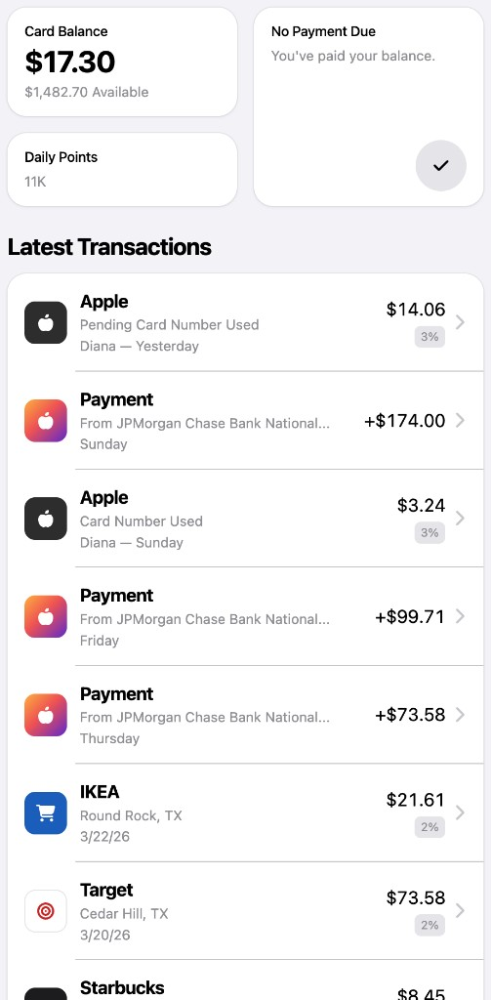
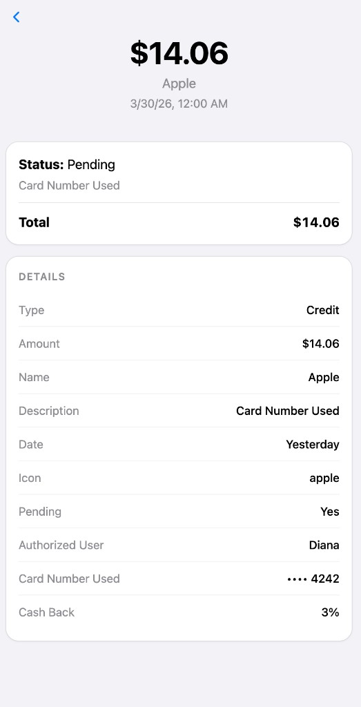

# Wallet App (MVP)

**Live demo:** [https://vadimoffski.github.io/get_report/](https://vadimoffski.github.io/get_report/) (GitHub Pages.)

### If GitHub Actions does not run

If workflows fail with a **billing / account locked** message, GitHub is blocking Actions on the account (fix under **Settings → Billing** for the user or organization). You can still publish the site **without Actions**:

1. Run `npm run deploy:gh-pages` (builds with `/get_report/` base and pushes `dist` to the `gh-pages` branch).
2. In the repo: **Settings → Pages → Build and deployment → Source**, choose **Deploy from a branch**, branch **`gh-pages`**, folder **`/ (root)`**.

When billing is resolved, you can switch the Pages source back to **GitHub Actions** to use the workflow in `.github/workflows/deploy-github-pages.yml`.

Mobile-first **wallet UI** built as a test assignment: a two-screen flow inspired by Apple Wallet / Apple Card—transaction list plus full transaction details. Data is **JSON-driven**; business rules (balances, dates, seasonal points) are implemented in TypeScript.

## Features

- **Transactions list** — Card summary ($1,500 limit, balance, **available = limit − balance**), “No payment due” message, **daily points** from a **seasonal formula**, and up to **10** transactions.
- **Transaction detail** — Opens from any row; shows status summary card and a **Details** section with all fields (type, amount, name, description, date, pending, authorized user, card, location, cash back, icon key).
- **Formatting** — `Payment` amounts show a leading `+`; `Credit` does not. Dates: Today / Yesterday / weekday (within the last week) / numeric date for older rows. Points ≥ 1,000 use **K** notation (e.g. `28745` → `29K`).
- **Icons** — Font Awesome solid icons with JSON or deterministic dark fallback backgrounds (payment rows use a gradient tile).

## Screenshots

Captured from the running app (`npm run dev`).

### Transactions list



### Transaction detail



## Tech stack

- **React 18** + **TypeScript** (strict)
- **Vite 8**
- **Tailwind CSS v4** with **`@tailwindcss/vite`**
- **Font Awesome** (`@fortawesome/react-fontawesome`, `@fortawesome/free-solid-svg-icons`)

## Getting started

```bash
npm install
npm run dev
```

Open [http://localhost:5173](http://localhost:5173). The layout is optimized for narrow viewports (max width ~480px).

### Scripts

| Command        | Description              |
| -------------- | ------------------------ |
| `npm run dev`  | Start dev server + HMR   |
| `npm run build`| Typecheck + production build |
| `npm run preview` | Serve production build locally |
| `npm run lint` | Run ESLint               |

## Project structure

```
docs/
└── screenshots/             # README screenshots (list + detail)
src/
├── components/
│   ├── transactions-list/   # List screen + dashboard cards + row
│   └── transaction-detail/ # Detail screen
├── data/
│   └── transactions.json    # Card + transactions (edit test data here)
├── hooks/
│   └── use-transactions.ts  # Async load of JSON
├── styles/
│   └── globals.css          # Tailwind + shared card styles
├── types/
│   └── index.ts             # Wallet / card / transaction types
├── utils/                   # Currency, dates, points, season math, icons
├── App.tsx
└── main.tsx
```

## Data & rules

- **Source of truth:** `src/data/transactions.json`.
- **Daily points:** Computed for “today” from the current season start (Mar 1 / Jun 1 / Sep 1 / Dec 1): day 1 → 2 pts, day 2 → 3 pts, then `round(P[i-2] + 0.6 × P[i-1])`.

## License

Private / test project—use as you prefer.
